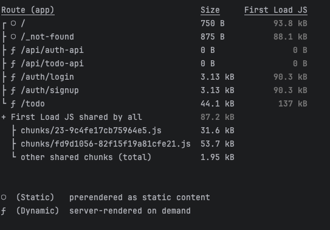

# Next.js Todo Web App
**version 0.9.0**

## Description

The **Next.js Todo Web App** is a monolithic to-do list application built using modern web technologies. The app leverages **Next.js** for the frontend and backend, **Tailwind CSS** for styling, **Clerk** for authentication, **Redux** for global state management, **Framer Motion** for animations, and **React Beautiful DND** for drag-and-drop functionality. This project also includes a **demo mode**, originally built for an employment opportunity submission.

## Features

- **Authentication**: Secure user sign-in and sign-out using Clerk. Demo Mode uses users that are mentioned in the fetched mock data and updates the user with a numerical username range that can be used against the data.
- **Task Management**: Add, modify, and rearrange to-do tasks with smooth drag-and-drop interactions.
- **Demo Mode**: Experience the application without signing up. Perfect for quick showcases.
- **Animations**: Enhanced user experience with smooth transitions using Framer Motion.
- **Backend**: Built with Next.js API Routes, handling all the business logic on the server side.

## Using Demo Mode

[Site Link](https://todo-app.symphonytechsolutions.com)

To use demo mode:

- Click on the "Demo Mode" button on the homepage.
- Enter any number in the displayed range as your username and any characters for the password.
- You will be redirected to the dashboard, where you can test the drag-and-drop functionality and log out at any time.

## Production State



*Production bundle with sizes to be deployed to **AWS Amplify***

### Known Issues

- Drag and drop functionality has defects
  - *TDA-B1*: State array does not update when dragging a task to other column (In Progress)
  - *TDA-B2*: Dragging a task to the same column does not update the index (In Progress)
- Styling issues
  - *TDA-B3*: Mobile styling of todo list needs modifying (In Progress)
- State issues
  - *TDA-B4*: User switch in demo mode requires refreshing to see state change on screen (In Progress)


## File Structure

Here’s a simplified tree of the key files in the project:

```
  ├── src/ 
  │ ├── app/ 
  │ │ ├── api/
  │ │ │  ├── auth-api/ (api for authentication)
  │ │ │  ├── todo-api/ (api for to-do management and connecting to jsonplaceholder for mock data)
  │ │ ├── components/ 
  │ │ │ ├── TodoListContainer.tsx 
  │ │ │ ├── TodoListItem.tsx 
  │ │ │ ├── TodoList.tsx 
  │ │ │ ├── TodoProvider.tsx (For Redux)(For Redux)
  │ │ ├── auth/  (Authentication pages)
  │ │ ├── store/ (Redux store)
  │ │ ├── todo/ (To-do pages)
  │ │ │ ├── page.tsx 
  │ │ └── index.tsx 
  │ ├── interface/ (types)
  │ ├── assets/ (static assets)
  │ ├── styles/ 
  ├── next.config.js 
  ├── tailwind.config.ts 
  └── package.json
```


## How It Works

The Next.js Todo Web App is designed for ease of use and simplicity in managing your to-do lists. Here’s a breakdown of the core features:

1. **User Authentication**: Users can sign up, log in, and log out using Clerk. Upon successful authentication, users are redirected to the dashboard, where they can manage their to-do tasks.

2. **Task Management**: Users can:
    - **Add new tasks** by clicking the "Add Task" button.
    - **Modify tasks** by selecting any existing task.
    - **Rearrange tasks** using drag-and-drop functionality provided by **React Beautiful DND**.

3. **Demo Mode**:
    - To explore the app without creating an account, users can activate **Demo Mode** by clicking the "Demo Mode" button.
    - Enter any number (within the displayed range) for the login ID and any characters for the password.
    - Upon login, you will be redirected to the dashboard where you can rearrange tasks and log out.

4. **Animations**: Smooth, responsive animations are implemented using **Framer Motion** to enhance the user experience when interacting with tasks.

## Running the Project Locally

To run this project locally, follow these steps:

### Prerequisites

Ensure you have the following installed on your machine:

- **Node.js** (v16 or higher)
- **npm** or **yarn**

### Steps

1. **Clone the repository:**

   ```bash
   git clone https://github.com/ElementalTech04/nextjs-todo-app
   cd nextjs-todo-app
    ```
   
2. **Install dependencies:**

   Using npm:

   ```bash
   npm install
   ```

   Or using yarn:

   ```bash
   yarn install
   ```

3. **Set up environment variables:**

   Create a `.env.local` file in the root directory and configure the required environment variables:

   ```bash
   ENVIRONMENT=<dev|prod>
   NEXT_PUBLIC_API_BASE_URL<this_apps_domain_url>
   MOCK_DATA_API_URL=<mock_api_url>
   CHRONICLE_API_GATEWAY=<remote_api_url>
   NEXT_PUBLIC_AUTH_TOKEN_KEY=<auth_token_key_name>
   AUTH_TOKEN_SECRET=<auth_token_secret>
   ```

4. **Run the development server:**

   ```bash
   npm run dev
   ```

   Or:

   ```bash
   yarn dev
   ```

   Open [http://localhost:3000](http://localhost:3000) in your browser to view the app.

## Future Enhancements

- **Full Todo List Functionality**: In the near future, I will add the rest of the core functionality, such as marking tasks as completed, deleting tasks, and adding notes to tasks. For now, there is a demo mode that allows you to test the drag-and-drop functionality.
- **Persistent Task Storage**: Integration with a database to persist tasks across sessions.
- **Mobile Optimizations**: Further UI/UX improvements for mobile devices.

### Tracking

- *TDA-S1*: Add functionality to mark tasks as completed (v2)
- *TDA-S2*: Add functionality to delete tasks (v2)
- *TDA-S3*: Add functionality to add notes to tasks (v2)
- *TDA-S4*: Finish Clerk integration (v2)
- *TDA-S5*: Add Suspense for loading screens (v2)
- *TDA-S6*: Integrate with redis for auth and todo storage (v2)
- *TDA-S7*: Add accounts page (v2)
- *TDA-S8*: Add framer motions (v2)